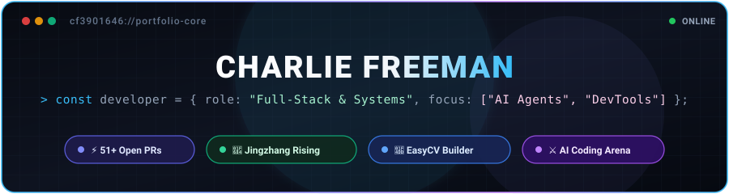

  

  

  
  
  
  
  
  
  

<b>✨ Developer Keynote Specifications / 核心技术规格一览</b>

 

| Dimension | Specification | Architecture Details |
| :--- | :--- | :--- |
| **Architect Profile** | Charlie Freeman | Full-Stack & Systems Engineer · Agentic Workflow Specialist |
| **Upstream Track Record** | 51+ Community PRs | Tornado, Pydantic, Cookiecutter, Turborepo Remote Cache |
| **Core Runtime Stack** | Modern Type Systems | Python (AsyncIO, AST, Pydantic) · TypeScript 5.x · React 19 · Node.js |
| **AI & Spatial Systems** | Autonomous Agent Swarms | Multi-Agent Coordination, Urban GIS Simulation (EPSG:4548), LLM Benchmarking |
| **Engineering Motto** | *Clarity, Reliability, Zero-Gravity UX* | "Eliminate cognitive friction; deliver rigorous upstream craftsmanship." |

---

### 💡 Vision & Engineering Philosophy / 架构愿景与简介

> **"Pragmatic systems engineering meets fluid, intelligent user experiences."**

I am a **Full-Stack & Systems Engineer** committed to building resilient developer tools, autonomous agent architectures, and responsive web applications. Inspired by Apple's precision craftsmanship and Google Antigravity's fluid, weightless interactivity, I combine typed Python runtimes, performant modern TypeScript/React interfaces, and automated agent workflows.

- 🔭 **Current Focus**: Designing context-efficient autonomous agent workflows, evaluating frontier AI coding assistants, and refining developer ergonomics across monorepos.
- 🌐 **Open Source Footprint**: Authored **51+ Pull Requests** across industry-standard libraries including **[Tornado](https://github.com/tornadoweb/tornado)**, **[Pydantic](https://github.com/pydantic/pydantic)**, **[Cookiecutter](https://github.com/cookiecutter/cookiecutter)**, and **[Turborepo Remote Cache](https://github.com/ducktors/turborepo-remote-cache)**.
- 🎨 **Design & Architecture Philosophy**: Strict static typing, fluid interaction boundaries, zero-bloat abstraction layers, and clear, human-centric documentation.
- 💬 **Collaborative Discussions**: Agent orchestration frameworks, Python AST / dynamic validator internals, modern front-end state machines, and GIS spatial computing.

---

### 🚀 Flagship Projects / 核心代表作

<table width="100%">
  <thead>
    <tr>
      <th width="28%">Project</th>
      <th width="47%">Description &amp; Architecture Highlights</th>
      <th width="25%">Tech Stack &amp; Links</th>
    </tr>
  </thead>
  <tbody>
    <tr>
      <td>
        <b><a href="https://github.com/cf3901646/haidian">Jingzhang Rising (京张向上)</a></b>
         
        🚄 43.6 km² 百年京张 AI 创新带城市设计 (96+ 官方就绪)
      </td>
      <td>
        The first-ever real-world urban design package autonomously generated by AI agents for Beijing Haidian's 43.6 km² innovation belt. Merged into upstream official competition (PR #4125), featuring 9 GeoJSON layers (EPSG:4548), pure CSS state-machine interactive visualizer, and "Human Fallback + Public Auditable Sheet" civic governance.
      </td>
      <td>
        <code>GIS</code> <code>EPSG:4548</code> <code>CSS3</code> <code>AI Agent</code>
          
        <a href="https://haidian.open-city.ai/submissions/cf3901646/jingzhang-rising/visual/index.html">🌐 <b>Live Demo 交互主页</b></a> 
        <a href="https://github.com/cf3901646/haidian">📦 <b>GitHub Repo</b></a>
      </td>
    </tr>
    <tr>
      <td>
        <b><a href="https://github.com/cf3901646/EasyCV">EasyCV 简历工作台</a></b>
         
        📝 极简纯粹本地 Markdown 可视化简历编辑器
      </td>
      <td>
        A zero-dependency, local-first visual resume builder built with pure HTML5, CSS3 &amp; Vanilla JavaScript. Features real-time WYSIWYG editing, 9 designer themes, light &amp; dark mode, mobile responsiveness, and high-fidelity PDF export.
      </td>
      <td>
        <code>Vanilla JS</code> <code>HTML5</code> <code>CSS3</code>
          
        <a href="https://easycvbuilder.vercel.app">🚀 <b>Live App 在线使用</b></a> 
        <a href="https://github.com/cf3901646/EasyCV">📦 <b>GitHub Repo</b></a>
      </td>
    </tr>
    <tr>
      <td>
        <b><a href="https://github.com/cf3901646/ai-coding-arena">AI Coding Arena</a></b>
         
        ⚔️ AI 编程智能体全场景盲测竞技场
      </td>
      <td>
        An interactive side-by-side benchmarking platform comparing 4 frontier AI coding assistants (<b>Google Antigravity</b>, <b>OpenAI Codex</b>, <b>AWS Kiro</b>, <b>GitHub Copilot</b>) on identical scenarios and prompts with directly playable embedded solutions.
      </td>
      <td>
        <code>JavaScript</code> <code>CSS3</code> <code>Benchmark</code>
          
        <a href="https://cf3901646.github.io/ai-coding-arena/">🔗 <b>Live Demo 在线体验</b></a> 
        <a href="https://github.com/cf3901646/ai-coding-arena">📦 <b>GitHub Repo</b></a>
      </td>
    </tr>
    <tr>
      <td>
        <b><a href="https://github.com/cf3901646/thermal-feels-like">Thermal Comfort Meter v2.0</a></b>
         
        🌡️ 智能双重体感温度计
      </td>
      <td>
        A thermodynamic sensible temperature simulation application that models human biological perception across dual environments (indoor comfort vs outdoor solar radiation &amp; wind chill), complete with Android native immersive system UI integration.
      </td>
      <td>
        <code>JavaScript</code> <code>Capacitor</code> <code>Android</code>
          
        <a href="https://github.com/cf3901646/thermal-feels-like">📦 <b>GitHub Repo</b></a>
      </td>
    </tr>
    <tr>
      <td>
        <b><a href="https://github.com/cf3901646/TalkNative">TalkNative (LingoFlow)</a></b>
         
        🎯 沉浸式地道英语口语听说私教
      </td>
      <td>
        An immersive language training application tailored for acquiring colloquial English speech patterns, situational conversational instincts, and listening fluency with modern reactive UI.
      </td>
      <td>
        <code>TypeScript</code> <code>React</code> <code>Vite</code>
          
        <a href="https://github.com/cf3901646/TalkNative">📦 <b>GitHub Repo</b></a>
      </td>
    </tr>
    <tr>
      <td>
        <b><a href="https://github.com/cf3901646/AITextRestorer">AITextRestorer</a></b>
         
        🎨 AI 图像中文变形自适应修复工具
      </td>
      <td>
        Desktop and Web utility engineered to detect, segment, and intelligently restore non-Latin (Chinese) text glyph distortions generated during AI image super-resolution and diffusion enhancements.
      </td>
      <td>
        <code>Python</code> <code>OpenCV</code> <code>Full-Stack</code>
          
        <a href="https://github.com/cf3901646/AITextRestorer">🐍 <b>Python Core</b></a> 
        <a href="https://github.com/cf3901646/AITextRestorer-Web">🌐 <b>Web Frontend</b></a>
      </td>
    </tr>
  </tbody>
</table>

---

### 🤝 Open Source Track Record &amp; Upstream Contributions / 开源贡献履历

Demonstrated hands-on experience contributing features, bugfixes, and refactors to major upstream open source ecosystems:

| Ecosystem / Repository | Key Contribution &amp; Scope | Impact / Issue Addressed | Status |
| :--- | :--- | :--- | :---: |
| **[tornadoweb / tornado](https://github.com/tornadoweb/tornado)** | Asynchronous TLS Connection Safety | Close SSL stream and cancel `start_tls` future on TLS timeout to prevent resource leaks ([#3735](https://github.com/tornadoweb/tornado/pull/3735)) | `In Review` ⏳ |
| **[pydantic / pydantic](https://github.com/pydantic/pydantic)** | Dynamic Validator Annotation Enhancements | Allow `PydanticDescriptorProxy` in `create_model` `__validators__` annotations ([#13837](https://github.com/pydantic/pydantic/pull/13837)) | `In Review` ⏳ |
| **[cookiecutter / cookiecutter](https://github.com/cookiecutter/cookiecutter)** | Robust VCS Error Handling | Preserve existing project template directory when clone operations fail ([#2270](https://github.com/cookiecutter/cookiecutter/pull/2270)) | `In Review` ⏳ |
| **[ducktors / turborepo-remote-cache](https://github.com/ducktors/turborepo-remote-cache)** | High-Performance Remote Cache Architecture | Added separate read URL support for CDN offloading ([#778](https://github.com/ducktors/turborepo-remote-cache/pull/778)) &amp; authored CDN documentation ([#874](https://github.com/ducktors/turborepo-remote-cache/pull/874)) | `Merged` 🎉 |
| **[open-city-ai / haidian](https://github.com/open-city-ai/haidian)** | Spatial Governance &amp; AI Simulation System | Engineered Report Card Simulator, street-level experiential views, and executable AI admission rules ([#4125](https://github.com/open-city-ai/haidian/pull/4125), [#3080](https://github.com/open-city-ai/haidian/pull/3080), [#2509](https://github.com/open-city-ai/haidian/pull/2509)) | `Merged` 🎉 |
| **[smithd36 / biomata-engine](https://github.com/smithd36/biomata-engine)** | Autonomous NPC Simulation Architecture | Extracted unified `_do_register_agent` pipeline to eliminate redundant agent registration routines ([#19](https://github.com/smithd36/biomata-engine/pull/19)) | `Merged` 🎉 |
| **[vm0-ai / okou](https://github.com/vm0-ai/okou)** | Reverse Proxy &amp; Usage Billing Fix | Safe merge handling for WebSocket OpenAI Responses billing usage ([#14568](https://github.com/vm0-ai/okou/pull/14568)) | `Merged` 🎉 |
| **[ncdai / chanhdai.com](https://github.com/ncdai/chanhdai.com)** | UI Component Theme Adaptation | Made testimonial spotlight theme-aware for dark/light mode consistency ([#1450](https://github.com/ncdai/chanhdai.com/pull/1450)) | `In Review` ⏳ |
| **[dimensionalOS / dimos](https://github.com/dimensionalOS/dimos)** | Physical Space Agent Operating System | Context window memory compaction when agent conversation history exceeds limits ([#3455](https://github.com/dimensionalOS/dimos/pull/3455)) | `In Review` ⏳ |
| **[tuchg / Lucarne](https://github.com/tuchg/Lucarne)** | Zero-Intrusion Mobile Agent Control Bridge | Added native runtime support for remote agent environments ([#48](https://github.com/tuchg/Lucarne/pull/48)) | `In Review` ⏳ |

---

### 🛠️ Technical Arsenal &amp; Specifications / 技术栈与架构图谱

  

| Domain | Core Technologies &amp; Architecture Toolchains |
| :--- | :--- |
| **Languages &amp; Core** | **Python** (AsyncIO, AST, Type-Hints, Pydantic, Pytest) · **TypeScript / JavaScript** (ES2024+, Node.js, Bun) · **HTML5 / CSS3 / SCSS** |
| **Frontend &amp; Mobile** | **React 18/19**, **Next.js**, **Vite**, **Tailwind CSS**, **shadcn/ui**, **Capacitor**, Android Native System Integration |
| **Backend &amp; Distributed** | **FastAPI**, **Node.js / Express**, RESTful APIs, WebSocket, CDN Caching, Turborepo Monorepo Architecture |
| **AI &amp; Autonomous Systems** | **LLM Agent Orchestration**, Multi-Agent Coordination, Assistant Benchmarking, Context Window Compaction |
| **DevOps &amp; Tooling** | **Git**, **GitHub Actions (CI/CD)**, Docker, Vercel, Linux System Administration |

---

### 📊 GitHub Activity &amp; Real-Time Telemetry / 活跃度与数据看板

  
  

  

---

### ✨ Contribution Dynamics / 代码贡献脉络

> *"Continuous momentum, thoughtful commits, and persistent upstream craftsmanship."*

  <picture>
    <source media="(prefers-color-scheme: dark)" srcset="https://raw.githubusercontent.com/cf3901646/cf3901646/output/github-contribution-grid-snake.svg">
    <source media="(prefers-color-scheme: light)" srcset="https://raw.githubusercontent.com/cf3901646/cf3901646/output/github-contribution-grid-snake.svg">
    
  </picture>

---

### 📬 Connect &amp; Collaborate / 交流与合作

  
  
  
  

- 🌐 **Interactive Live Projects**: [AI Coding Arena](https://cf3901646.github.io/ai-coding-arena/) · [EasyCV Builder](https://easycvbuilder.vercel.app) · [Jingzhang Rising Visualizer](https://haidian.open-city.ai/submissions/cf3901646/jingzhang-rising/visual/index.html)
- 💻 **Open Source Collaboration**: Always open to partnering on autonomous developer tools, upstream libraries, and high-impact web products.
- 📧 **Direct Reach**: Drop an email at [cf3901646@gmail.com](mailto:cf3901646@gmail.com) or initiate a GitHub discussion.

 

  

